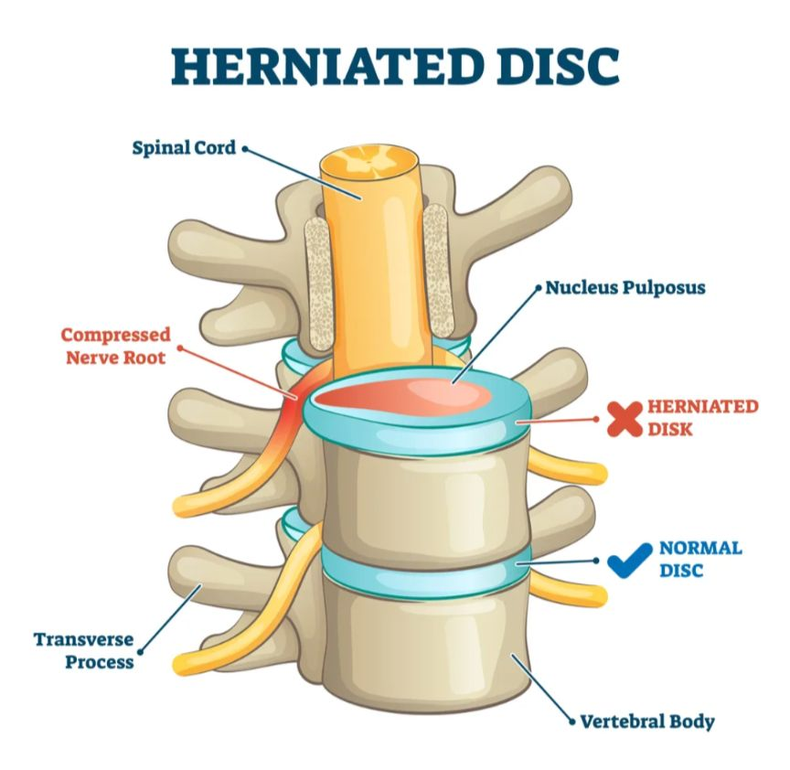
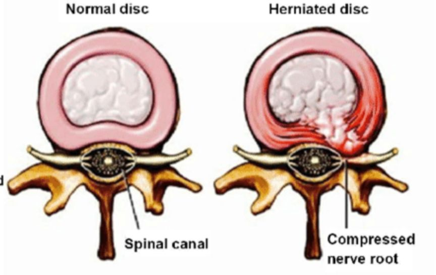

**Межпозвоночный диск** — это своеобразная "подушка" между позвонками позвоночника. Он состоит из плотной внешней оболочки (фиброзное кольцо) и мягкого внутреннего ядра (пульпозное ядро). Диски амортизируют нагрузку на позвоночник и позволяют позвонкам двигаться относительно друг друга.

**Грыжа** — это выпячивание или выдавливание внутреннего содержимого, которое выходит за пределы своего нормального положения. В данном случае это происходит с межпозвоночным диском, который начинает смещаться из-за разрыва или ослабления внешнего слоя диска.

 # L4-L5

> At L4-L5, there is a large hernia at the right postero-lateral aspect of the disc. The transverse diameter is 1.6cm. The hernia extends inferiorly over a distance of 1.4cm. It occupies the right lateral recess pushing the dural sac posteriorly and causing significant central stenosis. There is also significant compression on the right L5 nerve root.
### Перевод

***At the right postero-lateral aspect of the disc:***
*Правый* - указывает, что проблема находится с правой стороны позвоночника. *Постеро* - означает "сзади", а *латеральный* - "сбоку". Вместе это означает, что грыжа находится сзади и сбоку диска. То есть, грыжа выдвинулась в направлении правой задне-боковой части диска.

***Transverse diameter is 1.6 cm***: Поперечный (ширина) размер грыжи — 1,6 см.

***The hernia extends inferiorly over a distance of 1.4 cm***:
Грыжа распространяется вниз на 1,4 см. То есть она как бы «спускается» вдоль позвоночника на это расстояние.

***It occupies the right lateral recess***: Грыжа находится в правом боковом кармане позвоночного канала. Это область, где нервные корешки выходят из спинного мозга.

***Pushing the dural sac posteriorly***: Грыжа давит на дуральный мешок, смещая его назад. Дуральный мешок — это оболочка, окружающая спинной мозг и нервные корешки. Давление на него может приводить к боли и другим симптомам.

***Causing significant central stenosis***: Это вызывает серьёзный центральный стеноз. Стеноз — это сужение позвоночного канала, которое ограничивает пространство для нервов и спинного мозга. Центральный стеноз может привести к боли, слабости и онемению в ногах.

***There is also significant compression on the right L5 nerve root***:
Грыжа также сильно сдавливает правый нервный корешок на уровне L5 (пятый поясничный позвонок). Это может вызывать сильную боль и другие неврологические симптомы в зоне, за которую отвечает этот нерв (обычно это ягодица, задняя поверхность бедра, голень и стопа).

*Всё вместе это говорит о том, что грыжа достаточно большая и серьёзно давит на структуры, что может вызывать боль, онемение, слабость и другие неприятные симптомы.*

### Причины

Внешний слой межпозвоночного диска может разорваться или ослабнуть по ряду причин:

1. Возрастные изменения: Со временем диски теряют свою гибкость и увлажнённость, становясь более сухими и менее эластичными. Это делает их более подверженными повреждениям и износу.

2. Постоянные нагрузки: Повседневные нагрузки на позвоночник (например, от длительного сидения, подъёма тяжестей или наклонов) могут приводить к микроразрывам во внешнем слое диска. Эти маленькие повреждения накапливаются и в конечном итоге могут ослабить диск.

3. Травмы.

4. Неправильная осанка и биомеханика.

5. Наследственность.

# L5-S1
> At L5-S1, there is a small posterocentral disc protrusion causing indentation on the anterior epidural space but there is no significant compression or stenosis. A 2nd small protrusion is seen at the right lateral aspect of the disc indenting the right L5 nerve root. Again there is no significant compression.
### Перевод

L5-S1 — это уровень между пятым поясничным (L5) и первым крестцовым (S1) позвонками.

***Small posterocentral disc protrusion:***
это небольшое выпячивание диска, которое находится в центре и направлено назад (то есть оно выпячивается в направлении позвоночного канала, но по центру).

***Causing indentation on the anterior epidural space:***
это выпячивание создает небольшое вдавливание (давление) на переднюю часть эпидурального пространства, пространство вокруг спинного мозга и нервов. Но...

***There is no significant compression or stenosis:***
здесь нет значительного сдавливания нервов или сужения позвоночного канала, так что серьезных нарушений из-за этого выпячивания нет.

***2nd small protrusion at the right lateral aspect:***
также есть второе небольшое выпячивание, но уже справа и сбоку от диска.

***Indenting the right L5 nerve root:***
это выпячивание слегка давит на правый корешок нерва L5, но...

***No significant compression:***
значительного сдавливания или других серьёзных проблем это второе выпячивание тоже не вызывает.

*В итоге: есть два небольших выпячивания диска на уровне L5-S1. Одно из них давит на пространство вокруг спинного мозга, а второе — на нерв с правой стороны, но ни одно из них не вызывает серьёзного сдавливания или критического сужения пространства.*

# Summary

> Mild curvature of the lumbar spine convex to the left with loss of the lumbar lordosis.
> 
> Degenerative disc disease particularly significant at L4-L5 and milder at L5-S1.
> 
> The main abnormality is at L4-L5 where there is a large hernia as described above. It occupies the right lateral recess and compresses significantly the right L5 nerve root. It also causes significant central stenosis.

***Mild curvature of the lumbar spine convex to the left*** — это лёгкое искривление поясничного отдела позвоночника, где позвоночник слегка выгибается влево.

***Loss of lumbar lordosis*** — нормальный поясничный изгиб позвоночника (лордоз) сглажен. Обычно поясница немного прогибается вперёд, но здесь этот изгиб потерян, что может быть признаком мышечного напряжения, боли или дегенеративных изменений.

***Degenerative disc disease*** — дегенеративное заболевание дисков. Оно указывает на износ межпозвоночных дисков, при котором диски теряют свою гибкость и амортизирующие свойства, что может вызывать боль и дискомфорт.

***Particularly significant at L4-L5 and milder at L5-S1*** — дегенеративные изменения наиболее выражены на уровне между четвёртым и пятым поясничными позвонками (L4-L5), а на уровне L5-S1 (между пятым поясничным и первым крестцовым) они менее значительны.

> Small disc protrusions at L5-S1. Even though they cause no significant compression or stenosis, they can still cause focal or locally referred pain. Clinical correlation is recommended.

Это описание говорит, что на уровне L5-S1 есть небольшие выпячивания диска (протрузии), которые сами по себе не создают значительного сдавливания или сужения позвоночного канала. То есть, они не блокируют нервы или спинной мозг настолько, чтобы вызвать сильные симптомы, как в случае крупной грыжи.

Однако, несмотря на отсутствие выраженного сдавливания, такие протрузии всё равно могут вызывать локальную боль или рефлекторные боли (которые ощущаются в соседних областях). Это может происходить из-за раздражения рецепторов боли в диске или окружающих тканях.
